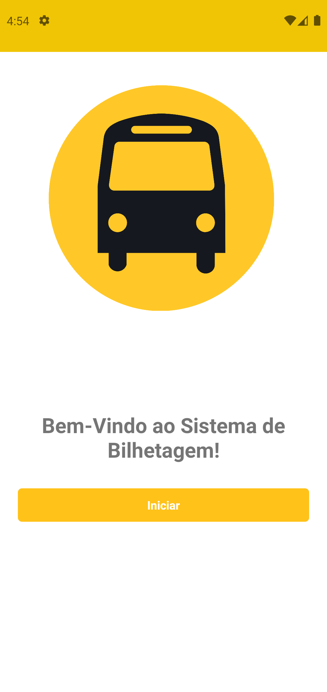
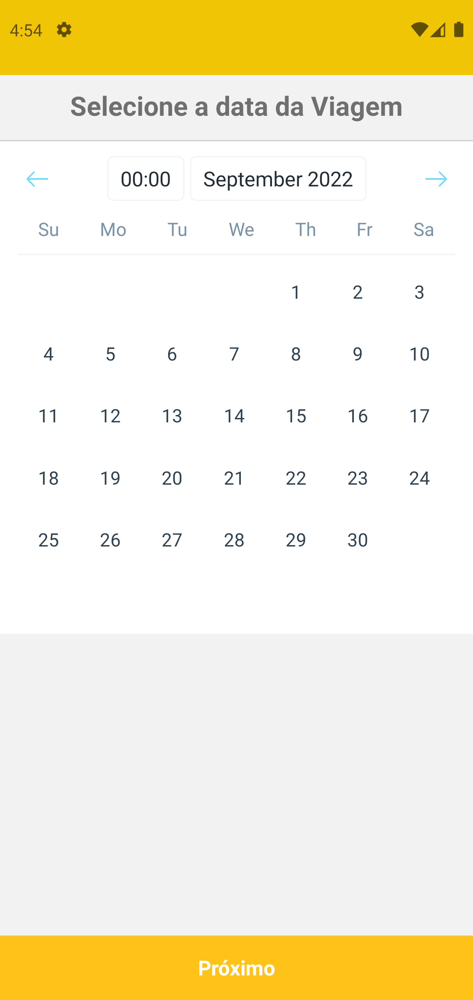
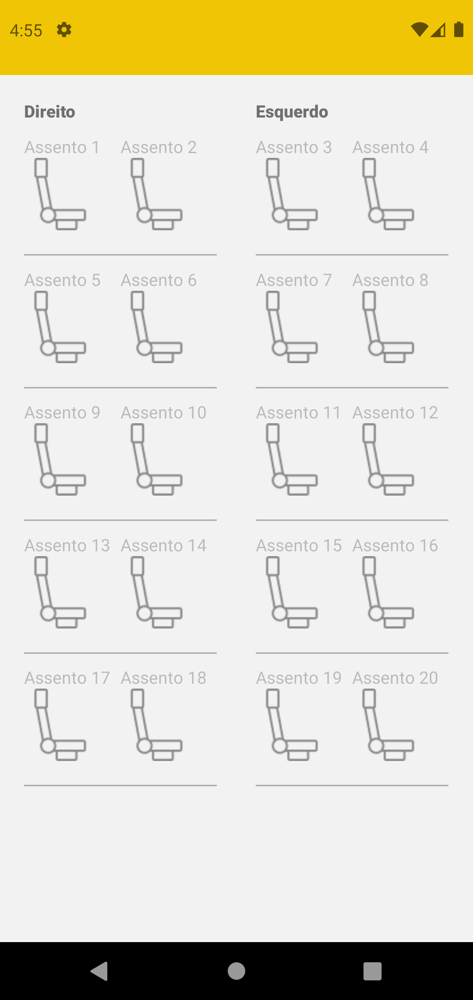
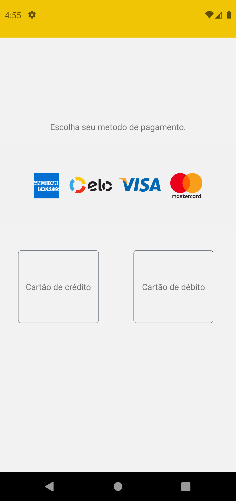

# Projeto de Compra de Passagem UI

Esse aplicativo teve como intuito de estudos sobre desenvolvimento de UIs com react native.

## Funcionalidades

- Welcome
- Formulário de Compra
- Escolha da Data da Viagem
- Escolha do Assento
- Opções de Pagamentos

## Instalação

Instale buyment com yarn

```bash
  cd buyment
  npx react-native run-android
```

## Demonstração

<p>

</p>
<p>

</p>
<p>

</p>
<p>

</p>
